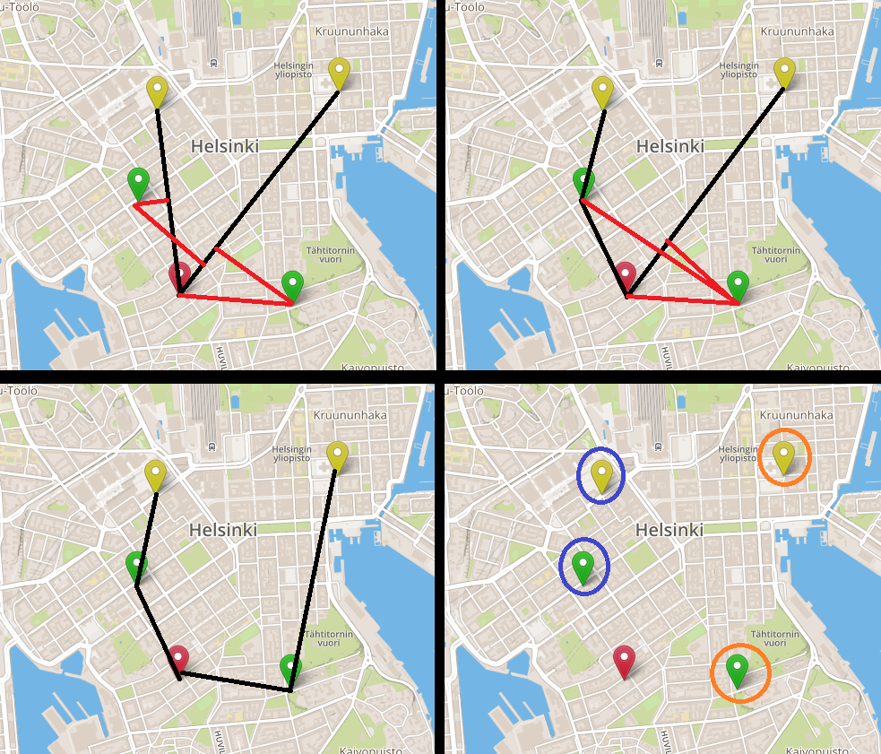
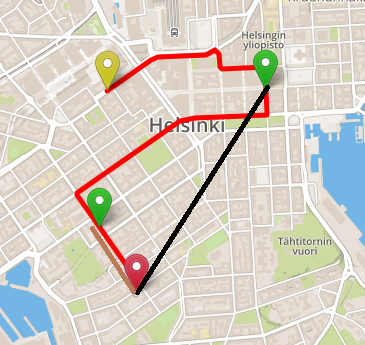

# DriveMe - *Environment First*

A Junction Online: Impact Hackathon project 
Preview: https://kounelisagis.me/driveme 
Product Hunt: https://www.producthunt.com/posts/driveme 

Environment is under attack! 
Why do we need carpooling immediately? 
- Huge CO2 emissions
- Urban traffic (nervous because of the wait times)
- Mass transit inability to cover every place

DriveMe is what you are looking for!

## What is it?
It's a Carpooling website responsible for finding the best routes(overall) given some people that will to use their cars and some people that don't. The only requirment is that they all have a common destination. Thus, it's very usefull for university students or employees of the same company.

## Backend
Implemented using Python (Flask)

We got three types of Points:
- Drivers (yellow)
- Candidates (green)
- Destination (red)

Everything in the backend is calculated using the flying distances between the points (a simple line segment). This might not seem a good technique in the real world, but it is. It makes the source code simpler and also helps as avoiding a lot of extra calculations and API calls. The results are confirmed to be very satisfactory.

### Grouping Phase
Every driver has a segment between him and the destination. 
We then find the closest point from one of those segments. 
The new route now consists of one extra line segment. 
We repeat this procedure until there are no candidates left. 
Below is an example: 

We finaly got our groups. But in which order has the driver to pick up the candidates?

### Sorting Phase
We simply sorting the candidates of each route using their flying distance in descending order. 
Example: 

We finally got our routes

## Frontend
Implemented using JavaScript (JQuery), HTML. 
Also used: Leaflet, Mapbox API, MapQuest API. 
The frontend part receives from the backend some points in the order we want them to have. Using the Mapbox API it finds the best route for them.

### Acknowledgments

- Junction organizers
- Corentin Mulders for his beautiful paper (https://www.info.ucl.ac.be/~pschaus/assets/master_thesis/2013_corentin_mulders.pdf). It helped me a lot.
